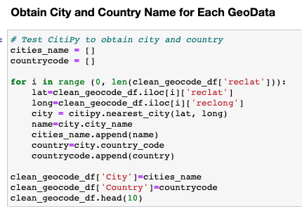
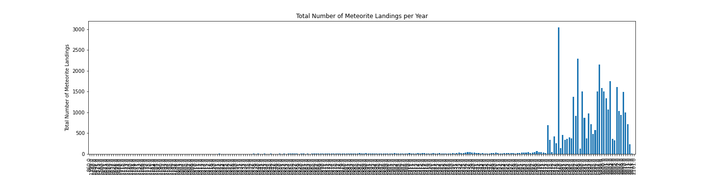
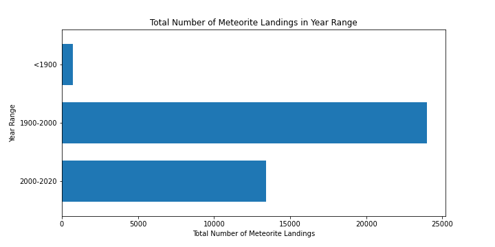
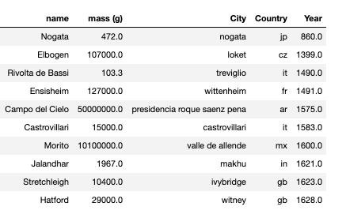
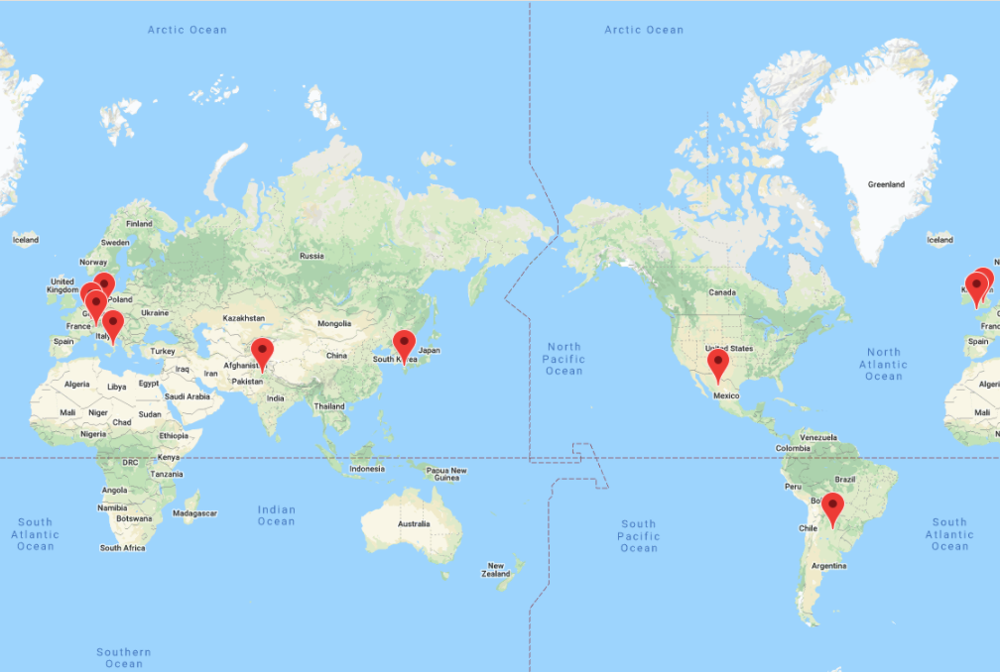
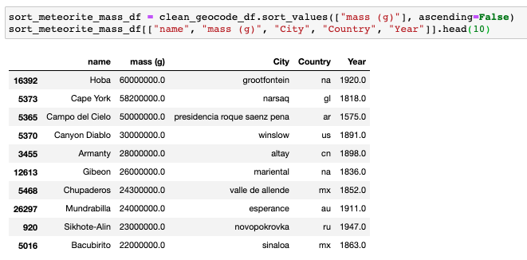
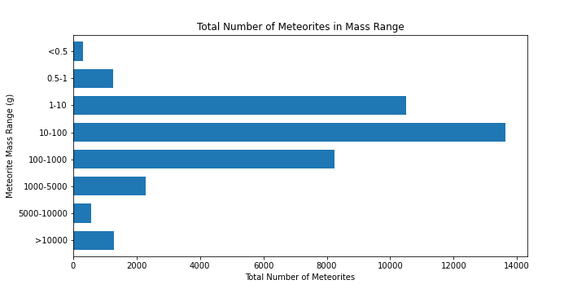
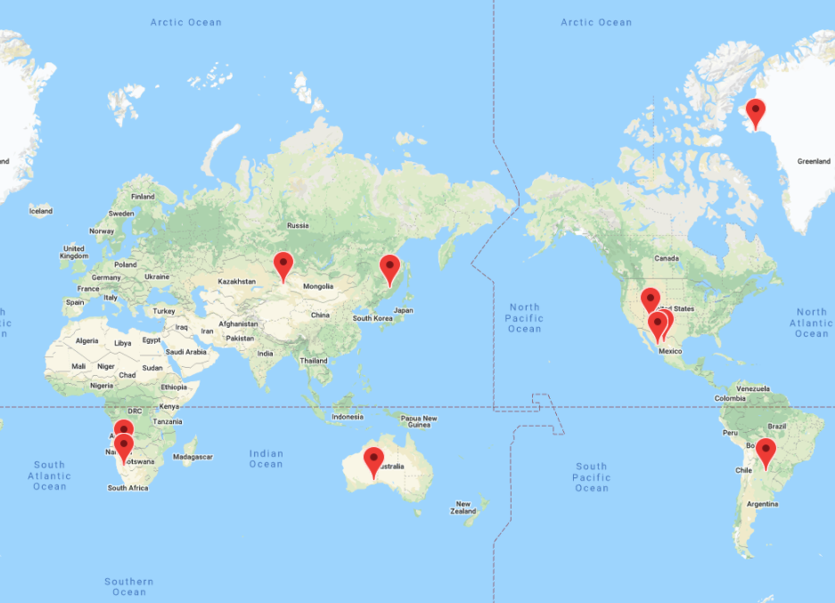
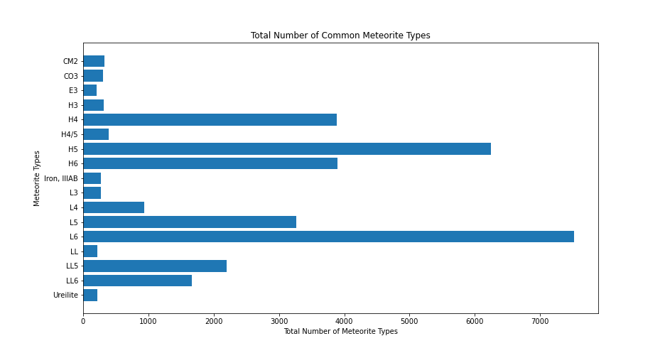
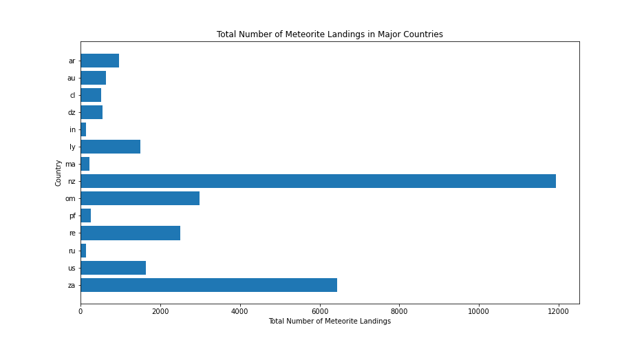

## NASA-Meteorites-Analyses

I was interested in exploring Meteorite Landings Data from NASA, Data.Gov. to examine how many meteorites were landed on earth.

### Research Questions to Answer:
1) How many meteorites were found? 
2) Which meteorites were found in the earliest year?
3) What sizes of meteorites were found so far? 
4) Where were the largest meteorites’ landing spots?
5) What types of meteorites did we find?
6) Which countries found more meteorites?

### Materials & Methods
1) I obtained the csv file from Data.gov - the total rows were 45,716. The last update was conducted on July 17, 2020.
2) I used: python - pandas (data manipulation), citipy (for obtaining city and country names to match with geo locations), and matplotlib and gmap (for visualization).
3) Data manipulation: I removed date and time from a column of 'year' by splitting the column information. I obtained city and country names for each data row using 'citipy' by using GeoLocation.

### Results
1) How many meteorites were found?

* I set up bins to create a range of years to show the total number of meteorites for each year range.
* There were 706, 24,004, and 13,404 meteorites discovered on earth < 1900, 1900-2000, and 2000-current year, respectively.
  

2) Which meteorites were found in the earliest year?
* The oldest meteorite found on earth was Nogata city in Japan in 860.

3 & 4) What sizes of meteorites were found so far? and Where were the largest meteorites’ landing spots?
* The most common size of meteorites were 10-100g.
* The largest meteorite was 60,000 kg, found near the city of Grootfontein in Nambia in 1920.

5) What types of meteorites did we find?
* There were 422 different types of meteorites were found.
* There are two majoy groups of meteorites - Chondrites and Achondrites.
** Chondrites are pre-planetaru rocks that formed about 4.5 billion years ago somewhere in the solar system.
** Achondrites are pieces of differentiated planetary bodies, like rocks and stones from moon or mars.
** The majority of meteorites were chondrites. 
** The only achondrites found so far was uleilite, but the origin of uleilite is still unknown.

6) Which countries found more meteorites?
* New Zealand had the most number of records of meteorites!

